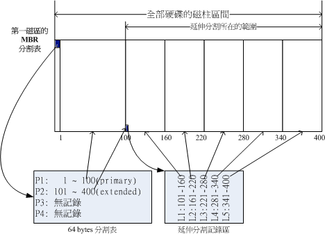

# 第三章 主机规划与磁盘分区
## 3.1 Linux与硬件的搭配
### 3.1.3 各硬件设备在Linux中的档名
『在Linux系统中，每个设备都被当成一个文件来对待』


## 3.2 磁盘分区

### 3.2.2 磁碟的组成

磁盘上面又可细分出磁区(Sector)与磁柱(Cylinder)两种单位，其中磁区大小为512 bytes。

整颗磁碟的第一个磁区特别的重要，它在硬盘上的三维地址为（柱面，磁头，扇区）＝（0，0，1），被称为主引导扇区，它记录了整颗磁碟的重要信息，分别是：

- 主引导记录(Master Boot Record, MBR)：可以安装启动管理程序的地方，有446 bytes
- 分割表(partition table)：记录整颗硬盘分割的状态，有64 bytes

MBR是很重要的，因为当系统在启动的时候会主动去读取这个区块的内容，这样系统才会知道你的程序放在哪里且该如何进行启动。 如果你要安装多重启动的系统，MBR这个区块的管理就非常非常的重要了。

### 3.2.3 磁盘分区表(partition table)

**磁柱**是文件系统的最小单位，也是分割槽的最小单位。在分割表所在的64 bytes容量中，总共分为四组记录区，每组记录区记录了该区段的起始与结束的磁柱号码。

由于分割表就只有64 bytes，最多只能容纳四笔分割的记录（*每个分区占16字节，具体每个字节的定义可以参见硬盘分区结构信息*）， 这四个分割的记录被称为主要(Primary)或扩展(Extended)分割槽。

分割的目的：

- 数据的安全性：
  每个分割槽的数据是分开的，格式化一个分割槽时，不会影响其他分割槽。
- 系统的效能考量：
  由于分割槽将数据集中在某个磁柱的区段，有助于数据读取的速度与效能！



主要分割、扩展分割与逻辑分割的特性可简单定义如下：

- 主要分割与扩展分配最多可以有四个(硬盘的限制)
- 扩展分配最多只能有一个(操作系统的限制，结合第一条可知，主要分割最多可有四个)
- 逻辑分割是由扩展分割持续切割出来的分割槽；
- 能够被格式化后，作为数据存取的分割槽为主要分割与逻辑分割，扩展分割无法格式化；
- 逻辑分割的数量依操作系统而不同，在Linux系统中，IDE硬盘最多有59个逻辑分割(5号到63号)， SATA硬盘则有11个逻辑分割(5号到15号)；
- 逻辑分割不可占用1、2、3、4编号，这四个编号固定分配给主要分割与扩展分割。

### 3.2.4 启动流程与主要启动记录区(MBR)

简单地说，整个启动流程到操作系统之前的动作应该是这样的：

1. **BIOS**：启动主动运行的固件，会认识第一个可启动的设备；
2. **MBR**：第一个可启动设备的第一个磁区内的主要启动记录区块，内含启动管理程序；
3. **启动管理程序(boot loader)**：一支可读取核心文件来运行的软件；
4. **核心文件**：开始操作系统的功能...

BIOS与MBR都是硬件本身会支持的功能，至于Boot loader则是操作系统安装在MBR上面的一套软件了。由于MBR仅有446 bytes而已，因此这个启动管理程序是非常小而美的。 这个boot loader的主要任务有底下这些项目：

- **提供菜单**：使用者可以选择不同的启动项目，这也是多重启动的重要功能！
- **加载核心文件**：直接指向可启动的程序区段来开始操作系统；
- **转交其他loader**：将启动管理功能转交给其他loader负责。

『如果要安装多重启动， 最好先安装Windows再安装Linux』。这是因为：

- Linux在安装的时候，你可以选择将启动管理程序安装在MBR或各别分割槽的启动磁区， 而且Linux的loader可以手动配置菜单，所以你可以在Linux的boot loader里面加入Windows启动的选项；
- Windows在安装的时候，他的安装程序会主动的覆盖掉MBR以及自己所在分割槽的启动磁区，你没有选择的机会， 而且他没有让我们自己选择菜单的功能。

### 3.2.5 Linux安装模式下， 磁盘分区的选择

所谓的『挂载』就是利用一个目录当成进入点，将磁盘分区槽的数据放置在该目录下； 也就是说，进入该目录就可以读取该分割槽的意思。这个动作我们称为『挂载』，那个进入点的目录我们称为『挂载点』。

想要知道某个文件被放置在哪个分区时，使用反向追踪即可，哪个挂载点被最先遍历到，其对应的分区即为文件放置的分区。例如：/被挂载到partition1，/home被挂载到partition2，对于/home/debug/readme.md这个文件，反向遍历即为readme.md->debug->home->/，最先遍历到挂载点home，则可确定改文件放置于partition2。

# 第六章 Linux 的文件权限与目录配置

## 6.1 使用者与群组

Linux中的四个身份：root、user、group、others

Linux系统里账号、密码、群组信息记录文件：

- /etc/passwd：系统上的账号（MySQL、SVN等）与一般身份使用者，以及root的相关信息
- /etc/shadow：账号密码
- /etc/group：组名

## 6.2 Linux文件权限概念

### 6.2.1 Linux文件属性

### 

**1. 第一栏代表这个文件的类型与权限**

第一个字符代表这个文件是『目录、文件或链接文件等等』：

- 当为[ **d** ]则是目录，例如上图档名为『.gconf』的那一行；
- 当为[ **-** ]则是文件，例如上图档名为『install.log』那一行；
- 若是[ **l** ]则表示为链接文件(link file)；
- 若是[ **b** ]则表示为区块(block)设备档，可供储存和随机存取的接口设备，例如硬盘。常见于/dev目录。
- 若是[ **c** ]则表示为字符(character)设备文件，亦即是一些串行端口的接口设备。例如键盘、鼠标(一次性读取设备)。常见于/dev目录。
- 若是[ **s** ]则表示数据接口文件(sockets)，这种类型的文件通常被用在网络上的数据承接。可以启动一个程序来监听客户端的要求， 而客户端就可以透过这个socket来进行数据的沟通，通常在/var/run这个目录中可以看到这种文件类型。
- 若是[ **p** ]则表示数据输送文件(FIFO, pipe)，用于解决多个程序同时存取一个文件所造成的资源竞争问题。

接下来的字符中，以三个为一组，且均为『rwx』 的三个参数的组合。其中，[ r ]代表可读(read)、[ w ]代表可写(write)、[ x ]代表可执行(execute)。 要注意的是，这三个权限的位置不会改变，如果没有权限，就会出现减号[ - ]而已。

- 第一组为『文件拥有者的权限』，以『install.log』那个文件为例， 该文件的拥有者可以读写，但不可执行；
- 第二组为『同群组的权限』；
- 第三组为『其他非本群组的权限』。

另外，目录与文件的权限意义并不相同，这是因为目录与文件所记录的数据内容不相同所致。

**2. 第二栏表示有多少文档链接到此节点(i-node)**

每个文件都会将它的权限与属性记录到文件系统的i-node中。这个属性记录的，就是有多少不同的档名链接到相同的一个i-node。

**3. 第三栏表示这个文件(或目录)的『拥有者账号』**

**4. 第四栏表示这个文件的所属群组**

**5. 第五栏为这个文件的容量大小，默认单位为bytes**

**6. 第六栏为这个文件的建档日期或者是最近的修改日期**

这一栏的内容分别为日期(月/日)及时间。如果这个文件被修改的时间距离现在太久了，那么时间部分会仅显示年份。如果想要显示完整的时间格式，可以利用ls的选项，亦即：『ls -l --full-time』就能够显示出完整的时间格式了！包括年、月、日、时间喔。 

**7. 第七栏为这个文件的档名**

这个字段就是档名了。比较特殊的是：如果档名之前多一个『 . 』，则代表这个文件为『隐藏档』。隐藏档需要使用『ls』及『ls -a』命令才能显示出来。

### 6.2.2 如何改变文件属性与权限：chgrp, chown, chmod

**改变所属群组chgrp**

要被改变的组名必须要在/etc/group文件内存在才行，否则就会显示错误！

```bash
[root@www ~]# chgrp [-R] 用户组 文件或目录 ...
选项与参数：
-R : 进行递归(recursive)的持续变更，亦即连同次目录下的所有文件、目录
     都更新成为这个群组之意。常常用在变更某一目录内所有的文件之情况。
范例：
[root@www ~]# chgrp users install.log
[root@www ~]# ls -l
-rw-r--r--  1 root users 68495 Jun 25 08:53 install.log
[root@www ~]# chgrp testing install.log
chgrp: invalid group name 'testing'
```

**改变文件拥有者chown**

用户必须是已经存在系统中的账号，也就是在/etc/passwd 这个文件中有纪录的用户名称才能改变。

chown使用方法类似于chgrp，需要递归操作可加『 -R 』参数。

另外，chown可同时更改文件所属群组和拥有者，命令格式为『 chown [-R]  拥有者:用户组  文件或目录  』

**改变权限chmod**

- 数字方式

  r-4、w-2、x-1

  命令格式『 chmod [-R] abc 文件或目录 』，其中a、b、c分别代表owner、group、others的权限对应的数字值。需要递归操作可加『 -R 』参数。

- 符号方式

  使用**u, g, o**来分别代表user、group、others的身份，另外**a**代表全部的身份。

  

  ```bash
  [root@www ~]# chmod  u=rwx,go=rx  .bashrc
  # 注意喔！那个 u=rwx,go=rx 是连在一起的，中间并没有任何空格！
  [root@www ~]# ls -al .bashrc
  -rwxr-xr-x  1 root root 395 Jul  4 11:45 .bashrc
  ```

### 6.2.3 目录与文件之权限意义

**权限对文件的意义**

- r (read)：可读取此一文件的实际内容，如读取文本文件的文字内容等；
- w (write)：可以编辑、新增或者是修改该文件的内容(但不含删除该文件)；
- x (execute)：该文件具有可以被系统执行的权限。

在Windows下一个文件是否具有执行的能力是由『 扩展名 』来判断的， 例如：.exe, .bat, .com 等等，但是在Linux下，文件是否能被执行，则是由『x』这个权限来决定的！跟档名是没有绝对的关系的！

具有『w』权限可以写入/编辑/新增/修改文件的内容， 但并不能删除该文件！对于文件的rwx权限来说，主要都是针对『文件的内容』而言，与文件档名的存在与否没有关系喔！

**权限对目录的意义**

目录主要的内容在记录文件名列表，文件名与目录有强烈的关连啦！

- r (read contents in directory)：表示具有读取目录结构列表的权限，所以当你具有读取(r)一个目录的权限时，表示你可以查询该目录下的文件名数据。 所以你就可以利用 ls 这个指令将该目录的内容列表显示出来！
- w (modify contents of directory)
  - 建立新的文件与目录；
  - 删除已经存在的文件与目录(不论该文件的权限为何)
  - 将已存在的文件或目录进行更名；
  - 搬移该目录内的文件、目录位置。
- x (access directory)：用户能否进入该目录成为工作目录

注意：对于目录来说，『r』与『x』权限容易混淆，『r』权限只能读取目录下的文档名，并不能进入目录，『x』权限才能真正进入目录。简言之，具有『r』权限只能ls，具有『x』权限可ls也可cd。

### 6.2.4 Linux文件种类与扩展名

**Linux文件长度限制**

在Linux下，使用预设的Ext2/Ext3文件系统时，针对文件的档名长度限制为：

- 单一文件或目录的最大容许文件名为 255 个字符；
- 包含完整路径名称及目录 (/) 之完整档名为 4096 个字符。

## 6.3 Linux目录配置

### 6.3.1 Linux目录配置的依据--FHS

FHS标准用于规范Linux下各个目录的用途及使用建议。FHS针对目录树架构仅定义出三层目录底下应该放置什么数据而已，分别是：

- / (root, 根目录)：与开机系统有关；
- /usr (unix software resource)：与软件安装/执行有关；
- /var (variable)：与系统运作过程有关。

#### 6.3.1.1 根目录 (/) 的意义与内容

根目录是整个系统最重要的一个目录，因为不但所有的目录都是由根目录衍生出来的，同时根目录也与开机/还原/系统修复等动作有关。因为根目录是这么的重要，所以在FHS的要求方面，他希望**根目录不要放在非常大的分割槽内**， 因为越大的分割槽会放入越多的数据，如此一来根目录所在分割槽就可能会有较多发生错误的机会。

因此FHS标准建议：根目录(/)所在分割槽应该越小越好， 且应用程序所安装的软件最好不要与根目录放在同一个分割槽内，保持根目录越小越好。 如此不但效能较佳，根目录所在的文件系统也较不容易发生问题。

FHS定义出根目录(/)下应该要有下面这些次目录的存在才好：

| 目录        | 应放置文件内容                                               |
| :---------- | :----------------------------------------------------------- |
| /bin        | 【单人模式下可被执行的命令】系统有很多放置执行文件的目录，但/bin比较特殊。因为/bin放置的是在单人维护模式下还能够被操作的指令。 在/bin底下的指令可以被root与一般账号所使用，主要有：cat, chmod, chown, date, mv, mkdir, cp, bash等常用的指令。 |
| /boot       | 【系统启动】这个目录主要在放置开机会使用到的文件，包括Linux核心文件以及开机选项与开机所需配置文件等等。 Linux kernel常用的档名为：vmlinuz，如果使用的是grub这个开机管理程序，则还会存在/boot/grub/这个目录喔！ |
| /dev        | 【设备】在Linux系统上，任何设备都是以文件的形式存在于这个目录当中的。 只要通过存取这个目录底下的某个文件，就相当于存取某个设备。比要重要的文件有/dev/null, /dev/zero, /dev/tty, /dev/lp, /dev/hd, /dev/sd等等 |
| /etc        | 【配置】系统主要的配置文件几乎都放置在这个目录内，例如人员的账号密码文件、 各种服务的启始档等等。一般来说，这个目录下的各文件属性是可以让一般使用者查阅的，但是只有root有权限修改。FHS建议不要放置可执行文件(binary)在这个目录中喔。比较重要的文件有： /etc/inittab, /etc/init.d/, /etc/modprobe.conf, /etc/X11/, /etc/fstab, /etc/sysconfig/ 等等。 |
| /home       | 【一般用户家目录】这是系统默认的用户家目录(home directory)。在新增一个一般使用者账号时， 默认的用户家目录都会规范到这里来。比较重要的是，家目录有两种代号喔：<br/>~：代表目前这个用户的家目录；<br/>~dmtsai ：则代表 dmtsai 的家目录！ |
| /lib        | 【函数库】系统的函数库非常的多，而/lib放置的则是在开机时会用到的函式库， 以及在/bin或/sbin底下的指令会呼叫的函式库而已。 什么是函式库呢？可以将它想成是『外挂』，某些指令必须要有这些『外挂』才能够顺利完成程序的执行之意。尤其重要的是/lib/modules/这个目录， 因为该目录会放置核心相关的模块(驱动程序)喔！ |
| /media      | 【可移除设备】/media下放置的就是可移除的设备，包括软盘、光盘、DVD等设备都暂时挂载于此。常见的档名有：/media/floppy, /media/cdrom等等。 |
| /mnt        | 【临时挂载设备】如果想要暂时挂载某些额外的设备，一般建议放置到这个目录中。 在早期，这个目录的用途与/media相同，只是有了/media之后，这个目录就用来暂时挂载用了。 |
| /opt        | 【三方软件安装目录】这个是给第三方协力软件放置的目录。如果想要自行安装额外的软件(非原本的distribution提供的)，可以将软件安装到这里来。 不过，以前的Linux系统中，我们还是习惯放置在/usr/local目录下。 |
| /root       | 【root特权指令】Linux有非常多指令是用来设定系统环境的，这些指令只有root才能够使用来『设定』系统，其他用户最多只能用来『查询』而已。 放在/sbin底下的为开机过程中所需要的，里面包括了开机、修复、还原系统所需要的指令。 至于某些服务器软件程序，一般则放置到/usr/sbin/当中。至于本机自行安装的软件所产生的系统执行文件(system binary)， 则放置到/usr/local/sbin/当中了。常见的指令包括：fdisk, fsck, ifconfig, init, mkfs等等。 |
| /srv        | 【网络服务数据读取】srv可以视为『service』的缩写，是一些网络服务启动之后，这些服务所需要取用的数据目录。 常见的服务例如WWW, FTP等等。举例来说，WWW服务器需要的网页数据就可以放置在/srv/www/里面。 |
| /tmp        | 【临时文件】这是让一般使用者或者是正在执行的程序暂时放置文件的地方。 这个目录是任何人都能够存取的，所以需要定期的清理一下。当然，重要数据不可放置在此目录啊！ 因为FHS甚至建议在开机时，应该要将/tmp下的数据都删除！ |
| /lost+found | 【系统错误暂存】这个目录是使用标准的ext2/ext3文件系统格式才会产生的一个目录，目的在于当文件系统发生错误时，将一些遗失的片段放置到这个目录下。这个目录通常会在分割槽的最顶层存在， 例如你加装一颗硬盘于/disk中，那在这个系统下就会自动产生一个这样的目录『/disk/lost+found』 |
| /proc       | 【内存】这个目录本身是一个『虚拟文件系统(virtual filesystem)』！它放置的数据都是在内存当中， 例如系统核心、进程信息(process)、周边设备的状态及网络状态等等。因为这个目录下的数据都是在内存当中， 所以本身不占任何硬盘空间！比较重要的文件例如：/proc/cpuinfo, /proc/dma, /proc/interrupts, /proc/ioports, /proc/net/* 等等。 |
| /sys        | 【系统核心相关】这个目录其实跟/proc非常类似，也是一个虚拟的文件系统，主要也是记录与核心相关的信息。 包括目前已加载的核心模块与核心侦测到的硬件装置信息等等。这个目录同样不占硬盘容量！ |

因为根目录与开机有关，开机过程中仅有根目录会被挂载，其他分割槽则是在开机完成之后才会持续的进行挂载的行为。因此根目录下与开机过程有关的目录，就不能够与根目录放到不同的分割槽去！相关目录有这些：

- /etc：配置文件
- /bin：重要执行档
- /dev：所需要的设备文件
- /lib：执行档所需的函式库与核心所需的模块
- /sbin：重要的系统执行文件

#### 6.3.1.2 /usr 的意义与内容

usr 是 Unix Software Resource 的缩写，也就是『Unix操作系统软件资源』所放置的目录。因为是所有系统默认的软件（distribution 发布者提供的软件）都会放置到 /usr 下，因此这个目录有点类似 Windows 系统的『C:\Windows\ + C:\Program files\』这两个目录的综合体，系统刚安装完毕时，这个目录会占用最多的硬盘容量。 一般来说，/usr 的子目录建议有这些：

|    目录     | 应放置文件内容                                               |
| :---------: | :----------------------------------------------------------- |
|  /usr/bin/  | 绝大部分的用户可使用指令都放在这里！请注意与/bin的不同之处（是否与开机过程有关） |
|  /usr/lib/  | 包含各应用软件的函式库、目标文件(object file)，以及不被一般使用者惯用的执行档或脚本(script)。 某些软件会提供一些特殊的指令来进行服务器的设定，这些指令也不会经常被系统管理员操作， 那就会被放到这个目录下。要注意的是，如果你使用的是X86_64的Linux系统，那可能会有/usr/lib64/目录产生喔！ |
| /usr/local/ | 系统管理员在本机自行安装自己下载的软件(非distribution默认提供者)，建议安装到此目录， 这样会比较便于管理。举例来说，你的distribution提供的软件较旧，你想安装较新的软件但又不想移除旧版，此时你可以将新版软件安装于/usr/local/目录下。/usr/local下也具有bin, etc, include, lib...等子目录！ |
| /usr/sbin/  | 非系统正常运作所需要的系统指令。最常见的就是某些网络服务器软件的服务指令(daemon) |
|  /usr/src/  | 一般原始码建议放置到这里，src有source的意思。至于核心原始码则建议放置到/usr/src/linux/目录下。 |

#### 6.3.1.3 /var 的意义与内容

/var 是在系统运作后才会渐渐占用硬盘容量的目录。因为 /var 目录主要针对常态性变动的文件，包括缓存(cache)、登录档(log file)以及某些软件运作所产生的文件，包括程序文件(lock file, run file)，或者例如 MySQL 数据库的文件等等。常见的子目录有：

|    目录     | 应放置文件内容                                               |
| :---------: | ------------------------------------------------------------ |
| /var/cache/ | 应用程序本身运作过程中会产生的一些暂存档；                   |
|  /var/lib/  | 程序本身执行的过程中，需要使用到的数据文件放置的目录。在此目录下各自的软件应该要有各自的目录。举例来说，MySQL 的数据库放置到/var/lib/mysql/，而rpm的数据库则放到/var/lib/rpm去！ |
| /var/lock/  | 某些设备或者是文件资源一次只能被一个应用程序所使用，如果同时有两个程序使用该设备，就可能产生一些错误，因此就得要将该设备上锁(lock)，以确保该设备只会给单一软件所使用。 |
|  /var/log/  | 这是**登录文件**放置的目录！里面比较重要的文件如/var/log/messages, /var/log/wtmp(记录登入者的信息)等。 |
|  /var/run/  | 某些程序或者是服务启动后，会将他们的PID放置在这个目录下。    |
| /var/spool/ | 这个目录通常放置一些队列数据，这些数据被使用后通常都会被删除。举例来说，系统收到新信件会放置到/var/spool/mail/中， 但使用者收下该信件后该封信原则上就会被删除。信件如果暂时寄不出去会被放到/var/spool/mqueue/中， 等到被送出后就被删除。 |

### 6.3.2 目录树(directory tree)

目录不止能使用本地分区的文件系统，也可以使用网络上的 filesystem 。举例来说，可以利用 Network File System (NFS) 服务器挂载某特定目录等。


# 第七章 Linux 文件与目录管理

## 7.1 目录与路径
### 7.1.2 目录的相关操作： cd, pwd, mkdir, rmdir

Linux中，命令行前的『$』表示普通用户，『#』表示root用户。

- cd（Change Directory）

```bash
# 进入自己的家目录
$ cd ~
# 进入指定用户的家目录
$ cd ~hw
# 返回上一个工作目录
$ cd -
```

- pwd（Print Working Directory）

```bash
# 打印链接档的真实目录
$ pwd -P
# 例如：/var/mail是链接档，链接到/var/spool/mail
$ cd /var/mail && pwd -P
/var/spool/mail
```

- mkdir（Make Directory）

```bash
$ mkdir [-mp] 目录名称
选项与参数：
-m ：可直接配置文件的权限，不需要看默认权限 (umask) 的脸色～
-p ：递归创建多级目录
$ cd /tmp && mkdir -p test1/test2/test3
# 创建权限为711的目录
$ mkdir -m 711 test
```

- rmdir（Remove Directory，只能删除空目录）

```bash
# 自底向上删除多级空目录。先删空目录test3，删完后test2为空，可删除，再删除test1
$ rmdir -p test1/test2/test3
# 删除非空的目录
$ rm -r 目录名称
```

### 7.1.3 关于运行档路径的变量：$PATH

ls 命令的完整档名为：/bin/ls

为什么我们可以在任何地方运行/bin/ls这个命令呢？是因为环境变量 \$PATH 的帮助所致呀！

当我们运行 ls 命令的时候，系统会依照 \$PATH 定义的目录顺序，依次搜寻档名为 ls 的可运行档，如果在 \$PATH 定义的目录中含有多个档名为 ls 的可运行档，那么先搜寻到的同名命令先被运行！

PATH（一定是大写）这个变量的内容是由一堆目录所组成的，每个目录中间用冒号(:)来隔开，每个目录是有顺序之分的。 

```bash
$ echo $PATH
/usr/local/sbin:/usr/local/bin:/sbin:/bin:/usr/sbin:/usr/bin:/root/bin
```

关于PATH变量的说明：

- 不同身份使用者默认的PATH不同，默认能够随意运行的命令也不同(如root与vbird)；
- PATH是可以修改的，所以一般使用者还是可以透过修改PATH来运行某些位于/sbin或/usr/sbin下的命令来查询；
- 使用绝对路径或相对路径直接指定某个命令的档名来运行，会比搜寻PATH来的正确；
- 命令应该要放置到正确的目录下，运行才会比较方便；
- 本目录(.)最好不要放到PATH当中。

